# Spartan — Technical Architecture

> **Status:** Proposed architecture (design of record for the Spartan rebrand + integration phase).
> **App:** Spartan · **Package:** `com.spartan` (as-found code is under `com.vitalcompass`; rebrand is tracked in `docs/Spartan_Implementation_Plan.md`).
> **Audience:** engineers implementing the WHOOP + Calendar integrations and the daily-coaching loop on top of the existing local-first MVP.
>
> Canonical vocabulary: see docs/Spartan_Decisions.md (authoritative).

## 0. Source of truth and scope

This document is the technical architecture for Spartan. It is subordinate to the **Spartan decisions brief** (the single source of truth) and stays consistent with its sibling documents:

- `docs/Spartan_PRD.md` — product requirements and user-facing behavior.
- `docs/Spartan_Architecture.md` — **this document**.
- `docs/Spartan_Implementation_Plan.md` — phased build/test plan and the rebrand mechanics.
- `docs/Spartan_Codebase_Audit.md` — as-found inventory of the `com.vitalcompass` code being carried forward.

Section references written as **brief §3** (domain models), **brief §4** (enums / `MetricType` additions), **brief §5** (Room entities & v4 migration), **brief §6** (feature flags, scopes, redirect URIs), and **brief §7** (rule IDs) point at the corresponding numbered sections of the decisions brief.

Everything below is **grounded in the actual code** already present in `app/src/main/java/com/vitalcompass/`. Where a component does not yet exist (WHOOP adapter, Calendar adapter, coaching engine, secure token store), it is explicitly labeled **new** and specified so it can be built without contradicting what ships today. All wearable and calendar data described for the MVP is **mock/sample data** served by `MockWhoopClient` / `StubCalendarClient`; nothing here asserts production readiness, clinical validity, or any compliance certification.

### As-found technology baseline (from `app/build.gradle.kts`)

| Concern | Choice | Version |
| --- | --- | --- |
| Language / JVM target | Kotlin, JVM 17 | `JVM_17` |
| UI | Jetpack Compose + Material 3 | Compose BOM `2024.12.01`, `material3` |
| Navigation | Navigation Compose | `2.8.5` |
| DI | Hilt | `2.52` (KSP `com.google.devtools.ksp`) |
| Local DB | Room | `2.6.1` (`exportSchema = false`, DB version **3**) |
| Preferences | DataStore Preferences | `1.1.1` |
| Background work | WorkManager | `2.10.0` |
| SDK | `minSdk = 26`, `targetSdk = 35`, `compileSdk = 35` | — |
| Networking / crypto libs | **none present** | see §5, §9 — added only when the real adapters land |

The MVP has **no** Retrofit/OkHttp, no `security-crypto`, no auth SDKs, and makes **no network calls** (confirmed: `grep` for those artifacts returns nothing). That posture is preserved: the integration seams default to offline mock/stub implementations.

---

## 1. Proposed architecture

Spartan keeps the existing **clean, unidirectional layering** and extends it outward with adapter seams. UI observes a single `StateFlow`; user intents flow down through the ViewModel to the repository and engines; data flows up from Room and the (mock) adapters. Domain engines are pure Kotlin and DI-provided; the repository is the only component that talks to data sources.

```
┌──────────────────────────────────────────────────────────────────────────┐
│ UI / Compose  (com.spartan.ui)                                             │
│   SpartanRoot · TodayScreen · MetricsScreen · PlanScreen · ReviewScreen    │
│   Daily check-in · Settings/Privacy · ReminderSettings · Integrations      │
│        ▲ collectAsStateWithLifecycle(MainUiState)     │ user intents       │
│        │                                              ▼                     │
├──────────────────────────────────────────────────────────────────────────┤
│ ViewModel  (com.spartan.ui.screens.MainViewModel  — @HiltViewModel)        │
│   combine(prefs, healthBundle) → StateFlow<MainUiState>                     │
│        ▲ (immutable state)                            │ (suspend calls)     │
│        │                                              ▼                     │
├──────────────────────────────────────────────────────────────────────────┤
│ Domain engines  (com.spartan.domain.engine — pure Kotlin, DI-provided)     │
│   MetricEngine · InsightEngine · PlanEngine · ReviewEngine · ReminderEngine │
│   CoachingEngine (new) ── uses ──► RecommendationSource (new, pluggable)    │
│   SafetyEngine ◄── sanitize() gate on ALL generated copy ──────────────────│
│        ▲ domain models                                │                     │
│        │                                              ▼                     │
├──────────────────────────────────────────────────────────────────────────┤
│ Repository  (com.spartan.data.repository.HealthRepository — @Singleton)    │
│   single mediator over every data source; maps entities ⇄ domain models    │
│        │                    │                    │                 │        │
│        ▼                    ▼                    ▼                 ▼        │
├──────────────┬────────────────────┬──────────────────────┬────────────────┤
│ Room (local) │ WHOOP adapter      │ Calendar adapter     │ Secure token   │
│ AppDatabase  │ WhoopClient        │ CalendarClient       │ store          │
│ HealthDao    │  ├ MockWhoopClient │  ├ StubCalendarClient │ SecureToken-   │
│ DataStore    │  └ RealWhoopClient*│  └ Real* (future)     │ Store          │
│ (prefs)      │ WhoopAuthManager   │ CalendarAuthManager  │ (Keystore +    │
│              │ WhoopMapper        │ AvailabilityService  │ EncryptedSP)   │
└──────────────┴────────────────────┴──────────────────────┴────────────────┘
                       * network-capable stub, disabled by default
```

Mermaid equivalent (same graph, for renderers that support it):

```mermaid
flowchart TD
    UI["UI / Compose (com.spartan.ui)"]
    VM["MainViewModel (@HiltViewModel)"]
    subgraph Engines["Domain engines (com.spartan.domain.engine)"]
      ME[MetricEngine]
      IE[InsightEngine]
      PE[PlanEngine]
      RV[ReviewEngine]
      CE["CoachingEngine (new)"]
      RS["RecommendationSource (new, pluggable)"]
      SE["SafetyEngine (sanitize gate)"]
    end
    REPO["HealthRepository (@Singleton)"]
    ROOM[("Room + DataStore")]
    WHOOP["WHOOP adapter\nWhoopClient / Mock / Real*"]
    CAL["Calendar adapter\nCalendarClient / Stub / GoogleCalendarClient*"]
    SEC["SecureTokenStore\n(InMemoryTokenStore → EncryptedTokenStore)"]

    UI -- "collectAsStateWithLifecycle(MainUiState)" --> UI
    UI -- "user intents" --> VM
    VM -- "StateFlow<MainUiState>" --> UI
    VM --> Engines
    CE --> RS
    Engines -- "copy" --> SE
    VM --> REPO
    REPO --> ROOM
    REPO --> WHOOP
    REPO --> CAL
    WHOOP --> SEC
    CAL --> SEC
```



**Unidirectional data flow** is already implemented in `MainViewModel`: `combine(preferencesStore.onboardingComplete, notificationPermissionDenied, healthBundle)` produces a single immutable `MainUiState` via `stateIn(...)`; screens are stateless and render that state; intents (`addMetric`, `completeWorkout`, `saveReminder`, `deleteAllLocalData`) are plain methods that launch coroutines and mutate through the repository. The new coaching loop plugs into this same shape (a `dailyPlan` / `readiness` slice added to `MainUiState`), so no architectural inversion is introduced.

---

## 2. Module / package layout

Single Gradle module `:app`, namespace `com.spartan`. Packages mirror the layers. Names in **bold** are new; the rest are the existing `com.vitalcompass.*` packages renamed 1:1 during the rebrand.

| Package | Responsibility | Key types (existing → target) |
| --- | --- | --- |
| `com.spartan.ui` | Compose screens, navigation, theme | `SpartanRoot` (was `VitalCompassRoot`), `MainViewModel`, `MainUiState`, `Screens.kt`, `ui.theme.Theme` |
| `com.spartan.domain.model` | Immutable domain models + enums | `MetricType`, `HealthModels.kt`, **`WhoopSnapshot`**, **`ReadinessSnapshot`**, **`ReadinessBand`**, **`DailyActivity`**, **`DailyPlan`**, **`TimeWindow`** |
| `com.spartan.domain.engine` | Pure deterministic engines | `MetricEngine`, `InsightEngine`, `PlanEngine`, `ReviewEngine`, `ReminderEngine`, `SafetyEngine`, **`CoachingEngine`**, **`CoachingRule`**, **`RecommendationSource`**, **`RuleBasedRecommendationSource`** |
| `com.spartan.data.local` | Room + DataStore | `AppDatabase`, `HealthDao`, `Entities.kt`, `Converters`, `PreferencesStore`, **`DailyActivityEntity`**, **`IntegrationConnectionEntity`**, **`IntegrationDao`** |
| `com.spartan.data.repository` | Single data mediator | `HealthRepository`, **`IntegrationRepository`** |
| `com.spartan.data.whoop` | **new** — WHOOP adapter seam | **`WhoopClient`**, **`MockWhoopClient`**, **`RealWhoopClient`**, **`WhoopAuthManager`**, **`WhoopMapper`**, **`WhoopSyncService`**, **`WhoopDtos`** |
| `com.spartan.data.calendar` | **new** — Calendar adapter seam | **`CalendarClient`**, **`StubCalendarClient`**, **`GoogleCalendarClient`**, **`AvailabilityService`**, **`CalendarAuthManager`**, **`CalendarDtos`** |
| `com.spartan.data.reminder` | Local notifications | `ReminderScheduler`, `ReminderWorker` (extended for per-activity + coaching notifications) |
| `com.spartan.data.security` | **new** — secure token storage | **`SecureTokenStore`**, **`InMemoryTokenStore`** (Phase 1 default), **`EncryptedTokenStore`** (Phase 2), **`OAuthTokens`** |
| `com.spartan.data.export` | Local text/CSV export | `LocalExportFormatter` |
| `com.spartan.di` | Hilt wiring | `AppModule`, **`IntegrationModule`** (adapter `@Binds`) |

The dependency rule is strict and matches today's code: `ui → domain + repository`; `domain.engine → domain.model` only (no Android, no data); `data.* → domain.model`; `di` wires implementations to interfaces. Engines remain unit-testable off-device (see the existing `app/src/test/java/com/vitalcompass/domain/*`).

---

## 3. Data model

### 3.1 Existing Room entities (carried forward, in `Entities.kt`)

| Entity | Table | Primary key | Notable fields |
| --- | --- | --- | --- |
| `UserProfileEntity` | `user_profiles` | `id` (fixed `0`) | `displayName`, `heightCm`, `birthYear`, `sexAtBirth`, `updatedAtMillis` |
| `MetricEntryEntity` | `metric_entries` | `id` auto | `type: MetricType`, `value: Double?`, `unit`, `note`, `recordedAtEpochDay`, `createdAtMillis` |
| `TargetEntity` | `targets` | `id` auto | `metricType`, `minValue?`, `maxValue?`, `note` |
| `WorkoutSessionEntity` | `workout_sessions` | `id` auto | `type: WorkoutType`, `plannedMinutes`, `completedMinutes`, `rpe`, `painFlag`, `completedAtEpochDay` |
| `PlanWorkoutOverrideEntity` | `plan_workout_overrides` | `slotKey` | `minutes`, `updatedAtMillis` |
| `ReminderEntity` | `reminders` | `id` (String) | `title`, `body`, `hour`, `minute`, `enabled`, `frequency: ReminderFrequency`, `daysOfWeekMask`, `updatedAtMillis` |
| `WeeklyReviewEntity` | `weekly_reviews` | `id` auto | `weekStartEpochDay`, `adherencePercent`, `zone2Minutes`, `strengthSessions`, `nextWeekFocus` |

Enum columns persist via `Converters` (`MetricType`, `WorkoutType`, `ReminderFrequency` ↔ `String` by `name`).

### 3.2 New Room entities

**`DailyActivityEntity`** — per-day, per-activity state for the coaching daily plan. This is the durable record behind the daily check-in UI (`docs/Spartan_PRD.md`), distinct from the weekly `WorkoutSessionEntity` log.

| Field | Type | Notes |
| --- | --- | --- |
| `id` | `String` (PK) | `"<dateEpochDay>:<slug>"` |
| `dateEpochDay` | `Long` | the plan day |
| `title` | `String` | e.g. "Zone 2 easy ride" |
| `category` | `ActivityCategory` | `RECOVERY`, `MOVEMENT`, `ZONE2`, `STRENGTH`, `MOBILITY`, `BREATHWORK`, `SLEEP`, `HYDRATION`, `NUTRITION`, `MINDSET` |
| `priority` | `ActivityPriority` | `REQUIRED` / `RECOMMENDED` / `OPTIONAL` |
| `whyItMatters` | `String` | plain-language rationale |
| `relatedMetric` | `MetricType?` | optional linked metric |
| `instructions` | `String` | newline-joined steps |
| `estimatedMinutes` | `Int` | from the `DailyPlan` |
| `intensity` | `Intensity` | `REST` / `EASY` / `MODERATE` / `HARD` |
| `bestTimeOfDay` | `TimeOfDay` | `MORNING` / `MIDDAY` / `AFTERNOON` / `EVENING` / `ANYTIME` |
| `status` | `ActivityStatus` | `PLANNED` / `DONE` / `SNOOZED` / `SKIPPED` / `RESCHEDULED` / `MISSED` |
| `ruleId` | `String` | provenance rule id (brief §7) |
| `scheduledEpochMinute` | `Long?` | assigned window start (`AvailabilityService`) |
| `completedAtMillis` | `Long?` | set when `DONE` |
| `snoozedUntilMillis` | `Long?` | set when `SNOOZED` |
| `safetyNote` | `String?` | `SafetyEngine`-checked caution |
| `updatedAtMillis` | `Long` | last mutation |

**`IntegrationConnectionEntity`** — non-secret connection **metadata** for each provider. It records consent/status only; **it never stores tokens** (those live in `SecureTokenStore`, §9).

| Field | Type | Notes |
| --- | --- | --- |
| `provider` | `IntegrationProvider` (PK) | `WHOOP` / `GOOGLE_CALENDAR` |
| `status` | `ConnectionStatus` | `NOT_CONNECTED` / `CONNECTED` / `CONSENT_REVOKED` / `ERROR` |
| `consentGrantedAtMillis` | `Long?` | when the user granted consent |
| `scopes` | `String` | comma-joined granted scopes, for transparency UI |
| `lastSyncMillis` | `Long?` | — |
| `accountLabel` | `String?` | display-only label (e.g. masked email) — no raw PII beyond what the user connected |

Mock provenance is **not** a column: it is derived from `BuildConfig.USE_MOCK_WHOOP` / `USE_MOCK_CALENDAR` (true ⇒ mock) and the domain `isMock` flag on `WhoopSnapshot`/`DailyPlan` (§4), surfaced in UI so mock data is never mistaken for live data.

New converters: `ActivityCategory`, `ActivityPriority`, `ActivityStatus`, `Intensity`, `TimeOfDay`, `IntegrationProvider`, `ConnectionStatus` ↔ `String` (by `name`).

### 3.3 Migration v3 → v4

`AppDatabase` bumps `version = 3` → `version = 4`. Following the existing additive-migration pattern (`MIGRATION_1_2`, `MIGRATION_2_3`), add `MIGRATION_3_4` that **creates two new tables and touches nothing existing** (so no data loss, safe for local health data):

```kotlin
val MIGRATION_3_4 = object : Migration(3, 4) {
    override fun migrate(db: SupportSQLiteDatabase) {
        db.execSQL("""
            CREATE TABLE IF NOT EXISTS daily_activities (
                id TEXT NOT NULL PRIMARY KEY,
                dateEpochDay INTEGER NOT NULL,
                title TEXT NOT NULL, category TEXT NOT NULL, priority TEXT NOT NULL,
                whyItMatters TEXT NOT NULL, relatedMetric TEXT,
                instructions TEXT NOT NULL,
                estimatedMinutes INTEGER NOT NULL, intensity TEXT NOT NULL, bestTimeOfDay TEXT NOT NULL,
                status TEXT NOT NULL, ruleId TEXT NOT NULL,
                scheduledEpochMinute INTEGER, completedAtMillis INTEGER, snoozedUntilMillis INTEGER,
                safetyNote TEXT, updatedAtMillis INTEGER NOT NULL
            )
        """.trimIndent())
        db.execSQL("""
            CREATE TABLE IF NOT EXISTS integration_connections (
                provider TEXT NOT NULL PRIMARY KEY,
                status TEXT NOT NULL, consentGrantedAtMillis INTEGER,
                scopes TEXT NOT NULL, lastSyncMillis INTEGER, accountLabel TEXT
            )
        """.trimIndent())
        db.execSQL("CREATE INDEX IF NOT EXISTS index_daily_activities_dateEpochDay ON daily_activities(dateEpochDay)")
    }
}
```

Register it in `di/AppModule.provideDatabase(...)` alongside the existing `.addMigrations(MIGRATION_1_2, MIGRATION_2_3, MIGRATION_3_4)` and rename the DB file `vital_compass.db` → `spartan.db` **as part of the rebrand, handled by the Implementation Plan** (a filename change is not a schema migration; on-device it is a fresh install unless a copy step is added — documented as a deliberate decision, not a silent break).

### 3.4 Internal `MetricType` additions (brief §4)

The existing enum (`domain.model.MetricType`) carries `(label, unit, lowerIsBetter)`. WHOOP normalization (§5) adds these **7** members so the mapper (§5) has typed targets. Note `RESTING_HEART_RATE` and `SLEEP_DURATION` already exist and are **reused** by WHOOP rather than duplicated. `SPO2`, `SKIN_TEMP`, and `READINESS` are intentionally **not** MVP `MetricType`s (documented as future).

| New `MetricType` | `label` | `unit` | `lowerIsBetter` | Purpose |
| --- | --- | --- | --- | --- |
| `RECOVERY_SCORE` | "Recovery" | `%` | `false` | primary readiness-band driver |
| `HRV_RMSSD` | "HRV" | `ms` | `false` | recovery/autonomic trend |
| `SLEEP_PERFORMANCE` | "Sleep performance" | `%` | `false` | sleep-debt rule input |
| `SLEEP_DEBT` | "Sleep debt" | `h` | `true` | sleep-debt rule input |
| `RESPIRATORY_RATE` | "Respiratory rate" | `rpm` | `false` | illness/context signal |
| `DAY_STRAIN` | "Day strain" | `` | `false` | load balancing vs recovery |
| `ENERGY_KCAL` | "Energy" | `kcal` | `false` | energy expenditure |

Implementation obligation: `MetricEngine.validate(...)` uses an **exhaustive `when`**, so each new type needs a validation branch (e.g. `RECOVERY_SCORE -> value in 0.0..100.0`, `HRV_RMSSD -> value in 5.0..300.0`, `SLEEP_PERFORMANCE -> value in 0.0..100.0`, `SLEEP_DEBT -> value in 0.0..24.0`, `RESPIRATORY_RATE -> value in 5.0..40.0`, `DAY_STRAIN -> value in 0.0..21.0`, `ENERGY_KCAL -> value in 0.0..10000.0`). These are **wearable/personal** metrics without a rigid clinical range, so they are intentionally **absent from `MetricEngine.clinicalRanges`** — `classifyClinical(...)` returns `ClinicalStatus.UNKNOWN`, which keeps the safety posture (no clinical overclaim) intact.

### 3.5 Coaching models (brief §3, in `domain.model`)

Pure, immutable data classes — no Android, no persistence coupling.

| Model | Kind | Shape (fields) |
| --- | --- | --- |
| `WhoopSnapshot` | WHOOP-layer normalized model | `dateEpochDay: Long`, `recoveryScore: Int?`, `hrvMs: Double?`, `restingHeartRate: Double?`, `sleepPerformance: Int?`, `sleepDurationHours: Double?`, `sleepDebtHours: Double?`, `respiratoryRate: Double?`, `dayStrain: Double?`, `energyKcal: Double?`, `isMock: Boolean` |
| `ReadinessBand` | enum | `PRIMED`, `BALANCED`, `EASY`, `REST` (from recovery score: `>=67 → PRIMED`, `50–66 → BALANCED`, `34–49 → EASY`, `<=33 → REST`; null recovery → `BALANCED` + `isStale`) |
| `ReadinessSnapshot` | **CoachingEngine input** (wearable-agnostic) | `recoveryScore: Int?`, `hrvMs: Double?`, `hrvVsBaseline: Double?`, `restingHeartRate: Double?`, `rhrVsBaseline: Double?`, `sleepPerformance: Int?`, `sleepDebtHours: Double?`, `dayStrainPrior: Double?`, `respiratoryRate: Double?`, `band: ReadinessBand`, `trendNotes: List<String>`, `isStale: Boolean`, `isMock: Boolean`; built by `ReadinessSnapshot.from(today, history)` |
| `DailyActivity` | plan element + check-in model | `id: String` (`"<dateEpochDay>:<slug>"`), `title: String`, `category: ActivityCategory`, `priority: ActivityPriority`, `whyItMatters: String`, `relatedMetric: MetricType?`, `instructions: List<String>`, `estimatedMinutes: Int`, `intensity: Intensity`, `bestTimeOfDay: TimeOfDay`, `status: ActivityStatus`, `ruleId: String`, `scheduledEpochMinute: Long?`, `completedAtMillis: Long?`, `snoozedUntilMillis: Long?`, `safetyNote: String?` |
| `TimeWindow` | value | `startEpochMinute: Long`, `endEpochMinute: Long` |
| `DailyPlan` | **CoachingEngine output** | `dateEpochDay: Long`, `headline: String`, `band: ReadinessBand`, `activities: List<DailyActivity>`, `totalEstimatedMinutes: Int`, `safetyBanner: String?`, `isMock: Boolean` |

### 3.6 Relationships

- `MetricEntryEntity.type` / `TargetEntity.metricType` → `MetricType` (typed enum column; targets compared **separately** from clinical ranges by `MetricEngine`).
- `DailyActivityEntity.id` (`"<dateEpochDay>:<slug>"`) ← `DailyActivity.id` (a `DailyPlan` for a date fans out into N `daily_activities` rows; completion updates flow back to `CoachingEngine`/`PlanEngine` as adherence + pain signals).
- `IntegrationConnectionEntity.provider` ↔ `SecureTokenStore` keyspace (metadata row here, secret material there; a `CONNECTED` row with no token is treated as `ERROR`).
- `ReadinessSnapshot` is assembled by `ReadinessSnapshot.from(today, history)` from a `WhoopSnapshot` (WHOOP-normalized) — it is **derived**, not a table.

---

## 4. Integration boundaries

The seams isolate "what is local and deterministic" from "what is networked and consented."

| Boundary | Local / deterministic | Networked (future, off by default) | Consent gate |
| --- | --- | --- | --- |
| WHOOP | `MockWhoopClient` sample data, `WhoopMapper`, `CoachingEngine` | `RealWhoopClient` + `WhoopAuthManager` OAuth | `IntegrationConnectionEntity(WHOOP)` must be `CONNECTED`; tokens present in `SecureTokenStore` |
| Calendar | `StubCalendarClient` sample busy blocks, `AvailabilityService` | `GoogleCalendarClient` + `CalendarAuthManager` | `IntegrationConnectionEntity(GOOGLE_CALENDAR)` `CONNECTED`; event **creation** requires an additional explicit opt-in |
| Notifications | `ReminderScheduler` + WorkManager (fully local) | — | `POST_NOTIFICATIONS` runtime permission |
| Persistence | Room + DataStore (fully local) | — | none (on-device only) |

Rules that make the boundary real:

1. **The repository is the only caller of adapters.** Engines and UI never import `data.whoop`/`data.calendar` types; they see domain models. This mirrors today's `HealthRepository`, which already maps entities → `MetricReading`/`TargetValue`/`WorkoutLog`.
2. **Default bindings are offline.** Hilt binds `WhoopClient → MockWhoopClient` and `CalendarClient → StubCalendarClient` by default (`BuildConfig.USE_MOCK_WHOOP` / `USE_MOCK_CALENDAR` = `true`, i.e. *true ⇒ mock*), so the MVP compiles and runs with **zero network calls** — consistent with `AGENTS.md` ("do not add … network calls, external health APIs … unless explicitly requested") and the local-first privacy model. Swapping to real clients is a DI change gated behind consent + setting the relevant flag `false`.
3. **Consent gating is enforced before any adapter fetch.** `IntegrationRepository.sync(provider)` short-circuits unless the `IntegrationConnectionEntity` status is `CONNECTED`. `MockWhoopClient` still requires a UI "Connect (mock)" action so the UX matches the real flow and mock data never appears unbidden.
4. **Mock provenance is always visible.** The `isMock` flag on `WhoopSnapshot`/`DailyPlan` (set whenever `USE_MOCK_WHOOP`/`USE_MOCK_CALENDAR` is `true`) propagates to the UI ("Sample WHOOP data" badge), so demo data is never presented as live measurements.

---

## 5. WHOOP adapter design (`com.spartan.data.whoop`)

### 5.1 Interface + implementations

```kotlin
// As built (see docs/Spartan_Decisions.md §7a). The client returns NORMALIZED WhoopSnapshots;
// the RealWhoopClient maps raw WHOOP DTOs into WhoopSnapshot internally, so WhoopMapper sits at
// the client boundary and everything above is wearable-agnostic.
interface WhoopClient {
    suspend fun fetchRecentDays(days: Int = 7): List<WhoopSnapshot>  // oldest first, today last
    val isMock: Boolean
}
```

- **`MockWhoopClient`** — the **default** binding. Returns a deterministic 7-day series of **mock/sample** `WhoopSnapshot`s (every one tagged `isMock = true`, surfaced as "Sample data" in the UI). No network, no auth. Used for the MVP, unit tests, and demos.
- **`RealWhoopClient`** — a **stub** wired to the WHOOP Developer Platform (REST + OAuth 2.0). It is present but **not bound** by default; it depends on Retrofit/OkHttp + kotlinx-serialization (**added only when this path is enabled**) and `WhoopAuthManager` for bearer tokens. Until enabled it throws `NotImplementedError("RealWhoopClient requires enabling the WHOOP network path")` so no partial network behavior ships accidentally.

### 5.2 `WhoopAuthManager` — OAuth 2.0 authorization-code flow

Standard authorization-code flow (with PKCE): app opens the WHOOP authorize URL in a Custom Tab → user consents → redirect back with `code` → exchange `code` for `{ access_token, refresh_token, expires_in }` → hand tokens to `SecureTokenStore` (never to Room, never logged). Refresh handled transparently before expiry using the stored refresh token; `offline` scope is what makes refresh tokens available. On refresh failure the connection row is marked `ERROR` and the user is re-prompted.

**Scopes requested (WHOOP):** `read:recovery`, `read:cycles`, `read:sleep`, `read:workout`, `read:profile`, `offline`. Requested minimally — drop any scope the coaching rules don't consume.

### 5.3 DTOs and `WhoopMapper` normalization

`WhoopDtos.kt` holds serialization models matching the WHOOP JSON (kotlinx-serialization `@Serializable`). `WhoopMapper` converts DTO → `WhoopSnapshot` (WHOOP-normalized) and persists `MetricEntryEntity` rows, doing unit conversion (e.g. sleep milliseconds → hours) and clamping; `ReadinessSnapshot.from(today, history)` then derives the engine input. This is the concrete realization of the canonical `WhoopSnapshot` fields (**brief §3**) and `MetricType` set (**brief §4**) (the source field is subject to verification against the live WHOOP API before the real path ships — the mapping is specified, not certified):

| WHOOP source field | WHOOP endpoint | → Spartan `MetricType` | Unit / transform | New? |
| --- | --- | --- | --- | --- |
| `score.recovery_score` | `/recovery` | `RECOVERY_SCORE` | `%`, 0–100 → drives `ReadinessBand` | new |
| `score.hrv_rmssd_milli` | `/recovery` | `HRV_RMSSD` | milliseconds | new |
| `score.resting_heart_rate` | `/recovery` | `RESTING_HEART_RATE` | bpm | **reuse existing** |
| `score.sleep_performance_percentage` | `/activity/sleep` | `SLEEP_PERFORMANCE` | `%` | new |
| `sleep_needed` vs actual sleep | `/activity/sleep` | `SLEEP_DEBT` | ms → hours (`/3.6e6`) | new |
| `score.stage_summary.total_in_bed_time_milli` | `/activity/sleep` | `SLEEP_DURATION` | ms → hours (`/3.6e6`) | **reuse existing** |
| `score.respiratory_rate` | `/activity/sleep` | `RESPIRATORY_RATE` | breaths/min | new |
| `score.strain` | `/cycle` | `DAY_STRAIN` | 0–21 | new |
| `score.kilojoule` | `/cycle` | `ENERGY_KCAL` | kJ → kcal (`/4.184`) | new |

`ReadinessBand` derivation lives in `WhoopMapper`/`CoachingEngine`, from the recovery score: `>= 67 → PRIMED`, `50–66 → BALANCED`, `34–49 → EASY`, `<= 33 → REST` (null recovery → `BALANCED` + `isStale`). A pain flag or acute illness signal is handled separately by the `PAIN_DELOAD` rule (§7). Persisted WHOOP readings are ordinary `MetricEntryEntity` rows with `note = "WHOOP (sample)"` in the mock path, so they flow through the existing Metrics/Review UI unchanged.

### 5.4 DI binding (`di/IntegrationModule`)

```kotlin
@Module @InstallIn(SingletonComponent::class)
abstract class IntegrationModule {
    @Binds @Singleton abstract fun bindWhoopClient(impl: MockWhoopClient): WhoopClient
    // Real path: swap to RealWhoopClient when BuildConfig.USE_MOCK_WHOOP is false + consent.
}
```

`WhoopAuthManager`, `WhoopMapper` provided as `@Singleton` via `@Provides` (they have no interface). `MockWhoopClient` needs no auth and no network.

---

## 6. Calendar adapter design (`com.spartan.data.calendar`)

### 6.1 Interface + implementations

```kotlin
// As built (see docs/Spartan_Decisions.md §7a). Reads are free/busy only — opaque busy TimeWindows,
// never event contents. Event creation is opt-in and requires the write scope.
interface CalendarClient {
    val isStub: Boolean
    suspend fun freeBusy(startEpochMinute: Long, endEpochMinute: Long): List<TimeWindow> // busy blocks
    suspend fun createEvent(title: String, startEpochMinute: Long, durationMinutes: Int): Result<String>
}
```

- **`StubCalendarClient`** — the **default** binding. Returns deterministic **mock/sample** busy blocks (e.g. `09:00–10:00`, `13:00–13:30`, `16:00–17:00`) so `AvailabilityService` can be exercised offline. `createEvent(...)` returns `Result.failure(UnsupportedOperationException)` in the stub.
- **`GoogleCalendarClient`** (Phase-2 stub) uses `CalendarAuthManager` + the Google Calendar REST API; it is present but **not bound** by default.

### 6.2 `AvailabilityService` — open-window algorithm

Pure, timezone-correct, DST-safe via `java.time.ZonedDateTime`. Its two entry points are `openWindows(constraints): List<TimeWindow>` and `suggestSlot(activityMinutes, constraints): TimeWindow?` (earliest fitting gap, or `null`). Given a date, the user's `ZoneId`, working hours, sleep window, quiet hours, and calendar busy blocks, it produces the day's `List<TimeWindow>` open for a session:

1. Build the **candidate day** in the user's zone: `[wakeTime + warmupBuffer, bedtime − winddownBuffer]`.
2. Intersect with the **exercise-preference band** (inside working hours, outside working hours, or both — a user preference).
3. **Subtract** calendar busy blocks (`freeBusy`), **quiet hours**, and the **sleep window**.
4. Drop fragments shorter than `minSessionMinutes` (default 20).
5. Return the remaining windows sorted by start (`openWindows`); `suggestSlot(estimatedMinutes, constraints)` returns the earliest window that fits a given `DailyActivity`, whose `scheduledEpochMinute` is set to that window's start.

All arithmetic uses `ZonedDateTime`/`Duration` so DST transitions and cross-midnight quiet/sleep windows are handled correctly.

### 6.3 `CalendarAuthManager` + scopes + opt-in event creation

Same OAuth 2.0 authorization-code + PKCE pattern as WHOOP, tokens in `SecureTokenStore`.

**Scopes (Google):** `https://www.googleapis.com/auth/calendar.freebusy` **only** for reads (least privilege — free/busy windows for availability, never event contents). Writing events adds `https://www.googleapis.com/auth/calendar.events` — **requested only when the user explicitly opts in** to "add sessions to my calendar," and revocable independently. No `openid`/`email` and no `calendar.readonly`. Reading availability never implies write access.

---

## 7. Coaching engine design (`com.spartan.domain.engine`)

### 7.1 Pipeline shape

`CoachingEngine` transforms a `ReadinessSnapshot` (+ context: recent `WorkoutLog`s, `DailyActivity` history, and `AvailabilityService` windows) into a `DailyPlan` by running an **ordered list of small, named, individually testable rules**. Each rule refines a mutable draft; the engine never mutates emitted domain models.

```kotlin
interface CoachingRule {
    val id: String   // one of the canonical rule ids (brief §7)
    fun apply(ctx: CoachingContext, draft: DailyPlanDraft): DailyPlanDraft
}

class CoachingEngine(
    private val rules: List<CoachingRule>,
    private val safetyEngine: SafetyEngine,
) {
    fun buildPlan(readiness: ReadinessSnapshot, options: CoachingOptions): DailyPlan {
        val ctx = CoachingContext(readiness, options)
        val draft = rules.fold(DailyPlanDraft.from(ctx)) { d, rule -> rule.apply(ctx, d) }
        return draft.toDailyPlan().also { plan -> plan.allCopy().forEach(safetyEngine::sanitize) }
    }
}
```

### 7.2 Rules (each small, named, unit-tested)

Each rule's `id` is one of the canonical rule ids (brief §7) and is carried onto the `DailyActivity.ruleId` it produces:

| Rule `id` | Responsibility |
| --- | --- |
| `LOW_RECOVERY` | low `RECOVERY_SCORE` → cap the day's ceiling intensity, bias toward recovery |
| `POOR_SLEEP` | low `SLEEP_PERFORMANCE` / high `SLEEP_DEBT` → bias toward recovery + earlier wind-down |
| `HIGH_STRAIN_LOW_RECOVERY` | avoid stacking high `DAY_STRAIN` on low recovery; cap target minutes |
| `LOW_HRV_TREND` | nudge easier when `HRV_RMSSD` is trending below the personal baseline |
| `ELEVATED_RHR_TREND` | nudge easier when resting heart rate is elevated vs baseline |
| `MISSED_GOAL` | respond to missed / under-adhered activities in recent history |
| `GOOD_RECOVERY_GREENLIGHT` | high recovery → green-light a harder session / easy aerobic (Zone 2) anchor |
| `PAIN_DELOAD` | if any recent `painFlag`, force `REST`/`RECOVERY` and pain-safe copy (mirrors `PlanEngine`'s deload logic) |
| `HYDRATION_BASELINE` | ensure a baseline hydration/mobility activity most days |
| `STALE_DATA_FALLBACK` | guarantee a non-empty, low-risk plan (mobility/walk) when data is stale or nothing else applies |
| `CLINICIAN_REFERRAL` | concerning vitals (very low HRV, very high RHR, respiratory-rate spike) → emit a "see a qualified clinician" activity (never a diagnosis) |

Window assignment is not a rule: after the rules produce the activity set, the engine calls `AvailabilityService.suggestSlot(estimatedMinutes, constraints)` per `DailyActivity` to set `scheduledEpochMinute` (§6.2).

### 7.3 `SafetyEngine` sanitize pass on all copy

`SafetyEngine` (existing) is the **non-negotiable final gate**: `buildPlan(...)` runs `safetyEngine.sanitize(...)` over **every** string in the emitted `DailyPlan` (headline, `safetyBanner`, and each `DailyActivity`'s `whyItMatters` + `safetyNote`). `sanitize` throws if copy matches the blocked patterns (`"you have diabetes"`, `"you need … statin/medication"`, `"exercise through pain"`, etc.), exactly as `PlanEngine.defaultPlan`, `InsightEngine.generate`, `MetricEngine.assess`, and `ReviewEngine.summarize` already do today. This holds regardless of which `RecommendationSource` produced the copy.

### 7.4 Pluggable `RecommendationSource` (so an AI source can be added without MVP depending on it)

```kotlin
interface RecommendationSource {
    suspend fun recommend(readiness: ReadinessSnapshot, options: CoachingOptions): DailyPlan
}

class RuleBasedRecommendationSource(
    private val coachingEngine: CoachingEngine,
) : RecommendationSource {
    override suspend fun recommend(readiness: ReadinessSnapshot, options: CoachingOptions) =
        coachingEngine.buildPlan(readiness, options)
}
```

- **MVP** binds `RecommendationSource → RuleBasedRecommendationSource` (deterministic, offline, testable). The rest of the app depends only on the `RecommendationSource` interface — **no MVP code references any AI**.
- A future `AiRecommendationSource` implements the same interface behind its own DI binding — a seam, **not** a flag that conflicts with the canonical `USE_MOCK_WHOOP`/`USE_MOCK_CALENDAR` pair. Its output is passed through **the same `SafetyEngine.sanitize` gate** (either inside its own `buildPlan`-equivalent or via a decorating source), so an AI source can never bypass the safety boundary. Provenance is carried by the active `RecommendationSource` binding and each `DailyActivity.ruleId`.

---

## 8. Notification scheduler design (`com.spartan.data.reminder`)

Extends the existing `ReminderScheduler` (WorkManager `PeriodicWorkRequest`, unique work per reminder id, `daysOfWeekMask` gating, `POST_NOTIFICATIONS` permission check) and `ReminderWorker` (`CoroutineWorker` emitting a `NotificationCompat` notification, `SecurityException`-safe) to drive the **daily coaching plan**.

New capabilities:

| Notification kind | Trigger | Mechanism |
| --- | --- | --- |
| **Per-activity reminder** | each `DailyActivity` with a `scheduledEpochMinute` | `schedulePlan(dailyPlan)` enqueues one uniquely-named `OneTimeWorkRequest` per activity keyed by `id` |
| **Pre-activity nudge** | `scheduledEpochMinute − leadMinutes` (default 15) | initial delay computed from the activity's scheduled start |
| **Missed follow-up** | `scheduledEpochMinute + estimatedMinutes + graceMinutes` with `status != DONE` | a follow-up worker checks `DailyActivityEntity.status`, marks `MISSED`, and (optionally) suggests a `RESCHEDULED` slot |
| **Completion confirm** | shortly after the activity's scheduled end | prompts "log how it went" → marks the activity `DONE`; any RPE/pain captured via the existing workout log feeds the `PAIN_DELOAD` rule in `CoachingEngine` |
| **Quiet hours** | any notification whose fire time ∈ quiet window | suppressed and deferred to the next allowed slot |
| **Coalescing** | multiple notifications due within a small window | batched into a single digest notification to avoid spamming |

Implementation notes:
- `ReminderWorker` gains a `KEY_NOTIFICATION_KIND` input and branches on it; today it already routes on `KEY_DAYS_OF_WEEK_MASK`/`isTodayEnabled(...)`, so the extension is additive.
- Separate `NotificationChannel`s: keep the existing reminders channel (`spartan_reminders`, renamed from `vital_compass_reminders`) and add a `spartan_coaching` channel so users can tune coaching nudges independently.
- Quiet hours + coalescing are computed with `java.time` in the user's zone; missed/confirm workers read `DailyActivityEntity` to stay idempotent (no duplicate nudges — reusing the `ReminderEngine.deduplicate`/`canSchedule` invariants and `enqueueUniquePeriodicWork(..., UPDATE)` semantics already in place).
- Everything stays **fully local** — no push service, no network.

---

## 9. Secure storage approach (`com.spartan.data.security`)

```kotlin
interface SecureTokenStore {
    fun save(key: String, value: String)
    fun load(key: String): String?
    fun clear(key: String)
}
```

- Phase-1 default binding **`InMemoryTokenStore`** (no real tokens exist with mock data). Phase-2 **`EncryptedTokenStore`** implements it over **`EncryptedSharedPreferences`** (`androidx.security:security-crypto`) with an **Android Keystore-backed `MasterKey`** (`AES256_GCM`) — the **only** dependency added for secure storage, and only when the integration path is enabled. Per-provider tokens are stored under namespaced keys (e.g. `whoop.access_token`), with `OAuthTokens` serialized to the stored string value.
- **Tokens never touch Room and are never logged.** `IntegrationConnectionEntity` holds only non-secret metadata (§3.2). Access/refresh tokens + expiry live exclusively in the token store (in-memory in Phase 1, encrypted in Phase 2). No token, code, or authorization header is ever written to `Log`, analytics, crash reporting, or the export file. `OAuthTokens.toString()` is overridden to redact.
- **`network_security_config.xml`** (new, `res/xml/`) sets `cleartextTrafficPermitted="false"` (app-wide, `usesCleartextTraffic=false` in the manifest) so the real adapters can only talk TLS. **Certificate pinning is a documented future hardening step** (pin WHOOP + Google hosts) — specified here, not yet enabled, to avoid brittle pins before the real path ships.
- On "disconnect" or consent revoke, `clear(key)` wipes the token entry and the connection row transitions to `NOT_CONNECTED`/`CONSENT_REVOKED`.

No secrets are committed. OAuth **client IDs** (public) and redirect URIs go in `BuildConfig`/`.env.example` placeholders (see `docs/Spartan_Implementation_Plan.md`); no client secret is embedded in the app (PKCE public-client flow), and no real or fake secret appears in this repository.

---

## 10. Privacy / security considerations

Spartan handles personal health data, so the `AGENTS.md` privacy model and the brief's safety rules are hard constraints.

- **Data minimization.** Request only the WHOOP/Calendar scopes the coaching rules consume (§5.2, §6.3). Persist only what's needed; `ReadinessSnapshot` is derived, not stored redundantly.
- **No PHI in logs or analytics.** There is **no analytics/telemetry/ads SDK** in the app (confirmed by the acceptance criteria and dependency audit), and none is added. Tokens and health values are never logged. Export (`LocalExportFormatter`) is a **user-initiated local** text/CSV snapshot only.
- **Consent + revoke.** Each integration is explicitly connected and independently revocable; calendar **write** is a separate opt-in from calendar **read** (§6.3). Status is transparent in the UI via `IntegrationConnectionEntity`.
- **Deletion.** `HealthRepository.deleteAllLocalData()` already clears every local table; it is extended to also clear `daily_activities`, `integration_connections`, and to call `SecureTokenStore.clear(...)` for every provider and `ReminderScheduler.cancelAll()`. `PreferencesStore.clear()` wipes DataStore. Backup/transfer stay disabled (`allowBackup=false`, `data_extraction_rules.xml` excludes `database`/`sharedpref`/DataStore) — extended to exclude the encrypted token store too.
- **BAA surface list.** The external processors that a HIPAA Business Associate Agreement analysis must cover, once the networked paths are enabled, are (this inventory is architecture-doc-specific; the decisions brief does not enumerate it):

  | Surface | Data leaving device | Status |
  | --- | --- | --- |
  | WHOOP Developer Platform API | recovery/HRV/sleep/strain (health data) | networked path **off by default** (mock in MVP) |
  | Google Calendar API | busy windows; opt-in event writes | networked path **off by default** (stub in MVP) |
  | Google OAuth / identity | email, OAuth tokens | only when Calendar is connected |
  | (future) AI coaching provider | readiness features → recommendation text | not present; gated behind the `RecommendationSource` seam |

  This is a **surface inventory for due diligence, not a compliance claim**. Spartan makes no representation of HIPAA compliance or any certification; MVP ships local-first with mock/stub adapters and **no** health data leaving the device.

---

## 11. Future scalability considerations

- **iOS via KMP.** The domain layer (`domain.model` + `domain.engine`: `MetricEngine`, `InsightEngine`, `PlanEngine`, `ReviewEngine`, `SafetyEngine`, `CoachingEngine`, rules) is pure Kotlin with no Android imports — a natural **Kotlin Multiplatform** `commonMain` extraction, letting an iOS client reuse the same deterministic engines and safety gate.
- **Coach dashboard + multi-tenant + access control.** The strict repository boundary and typed models make a future backend sync feasible: introduce a `RemoteSyncSource` behind the same repository seam, add tenant/user scoping and role-based access control at that layer. None of it perturbs the on-device MVP.
- **More wearables via the same adapter pattern.** New devices (Oura, Garmin, Apple Health, Fitbit) implement the `WhoopClient`-style interface + a `*Mapper` to the shared `MetricType`/`ReadinessSnapshot` vocabulary; the coaching rules consume normalized readiness regardless of source.
- **AI coaching layer via `RecommendationSource`.** Add `AiRecommendationSource` implementing the existing interface, behind its own DI binding/seam, with output forced through `SafetyEngine.sanitize`. MVP has zero dependency on it (§7.4).
- **Feature flags.** The canonical `BuildConfig.USE_MOCK_WHOOP` / `USE_MOCK_CALENDAR` flags (default `true`; *true ⇒ mock*) gate the mock-vs-real WHOOP/Calendar paths so networked paths can be toggled without code forks; experimental paths such as an AI coach are added behind the `RecommendationSource` seam (§7.4) rather than a conflicting flag.
- **Audit logs.** An append-only local `audit_events` table (connect, revoke, sync, export, delete) supports transparency and future compliance review; it stores actions/timestamps only, never PHI values or tokens.
- **Data export / portability.** `LocalExportFormatter` grows structured (JSON/CSV) export covering the new `daily_activities` and (non-secret) integration metadata, plus a Storage Access Framework "save file" flow — the production export path the PRD anticipates, keeping the user in control of their data.

---

### Cross-references

- Product scope and screens: `docs/Spartan_PRD.md`
- Phased build, rebrand mechanics, test/lint gates: `docs/Spartan_Implementation_Plan.md`
- As-found `com.vitalcompass` inventory: `docs/Spartan_Codebase_Audit.md`
